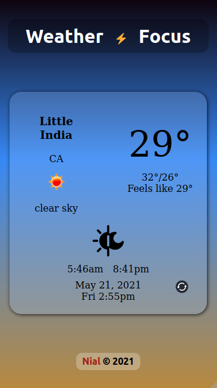

# Weather_Focus

A location base weather service web application.

## functionality
1. Using geolocation, rechieve data from [freecodecamp](https://weather-proxy.freecodecamp.rocks/) weather Api.
2. On clicking the current temperature, all temperature of the app alternate between Celsius and Fahrenheit.
3. The refresh button update the loaction and  temperature.

## Implimentation

The following languages, framework and libraries were used in the converter creation:
1. React
2. Redux
3. Scss
4. Redux-toolkit
5. Redux-thunk
6. Axios
9. Flex-box (for layout and responsiveness)
10. JavaScript ES6

## ScreenShot

## Credit

+ created by [Nial Hope](https://github.com/nhope123)
  + [Portfolio](https://nhope123.github.io/)

## License

Weather Focus is an open source software licensed as [GNU General Public License v3.0](LICENSE)
